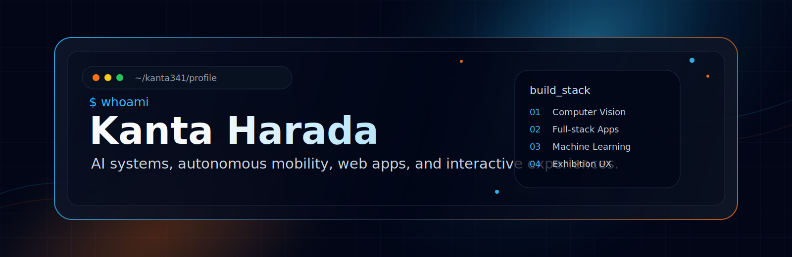
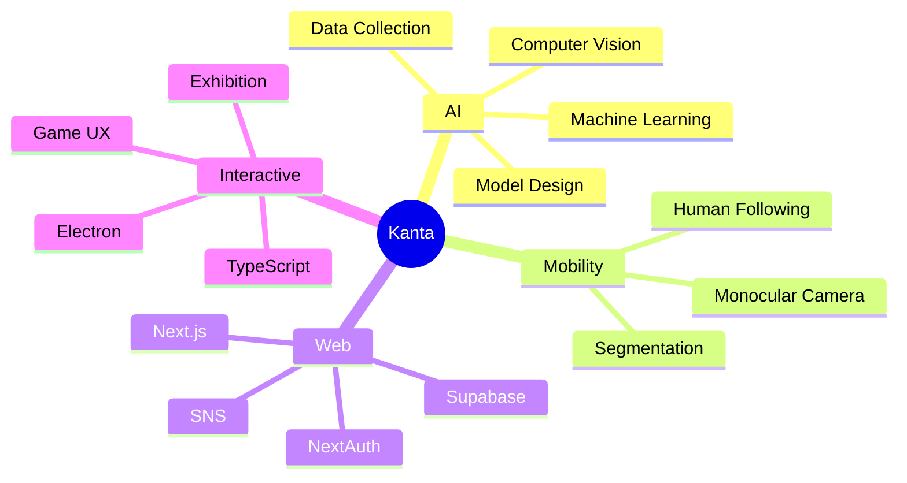

<p align="center">
  
</p>

<h1 align="center">Kanta Harada</h1>

<p align="center">
  
</p>

<p align="center">
  <a href="https://github.com/kanta341">
    
  </a>
  <a href="https://github.com/kanta341/Automotive_tank">
    
  </a>
  <a href="https://github.com/kanta341/Fruit_shooting">
    
  </a>
</p>

---

## About

東京大学 精密工学科 3年。AI、Webアプリ、自動化、体験型システムを中心に、アイデアを動くプロダクトまで持っていく開発に取り組んでいます。

```txt
Focus       AI tools / autonomous mobility / web apps / interactive experiences
Currently   Practical systems with Python, TypeScript, computer vision, and ML
Style       Prototype fast, validate with users, then refine the product
```

---

## What I Build

<table>
  <tr>
    <td width="33%">
      <h3 align="center">AI & Vision</h3>
      <p align="center">YOLO、semantic segmentation、TensorFlowを使った認識・推定モデルの設計と実装。</p>
    </td>
    <td width="33%">
      <h3 align="center">Web Products</h3>
      <p align="center">Next.js、Supabase、認証、AI支援機能を組み合わせた実用Webアプリ開発。</p>
    </td>
    <td width="33%">
      <h3 align="center">Interactive Systems</h3>
      <p align="center">Electron、TypeScript、Python、機械学習を組み合わせた展示・体験型プロダクト。</p>
    </td>
  </tr>
</table>

---

## Tech Stack

<p align="center">
  
  
  
  
  
  
  
  
  
  
  
</p>

---

## Featured Projects

<p align="center">
  <a href="https://github.com/kanta341/Automotive_tank">
    
  </a>
  <a href="https://github.com/kanta341/Fruit_shooting">
    
  </a>
  <a href="https://github.com/kanta341/idea-SNS">
    
  </a>
</p>

### 小型自動運転モビリティ

- YOLO + semantic segmentation を使った単眼カメラ搭載ラジコンの人追従システム
- Python中心で認識パイプラインと制御連携を開発
- Repository: [Automotive_tank](https://github.com/kanta341/Automotive_tank)

### お絵描きシューティングゲーム

- Electron + TypeScript + Python + 機械学習で、手描きのフルーツを弾として使える体験型シューティングゲームを開発
- 東京大学 5月祭で精密工学科の企画として展示し、約200名が体験、100名以上がクリア
- Repository: [Fruit_shooting](https://github.com/kanta341/Fruit_shooting)

### アイディア共有SNS

- Next.js + Supabase + NextAuth
- AIによるアイディア発想とSNSでの共有を組み合わせたWebアプリ
- Repository: [idea-SNS](https://github.com/kanta341/idea-SNS)

### Research & Experiments

- **マルチエージェントシミュレーション:** Pythonで大学構内の食堂混雑緩和をテーマにシミュレーション。データ収集・基礎モデル構築を担当。
- **迷路の難易度判定AIモデル:** TensorFlowで迷路難易度を推定するAIモデルを構築。データ収集からモデル設計まで一貫して実施し、強化学習やルールベース前処理も試行。

---

## Development Map



---

## GitHub Metrics

<p align="center">
  
  
</p>

<p align="center">
  
</p>

---

## Contribution Graph

<p align="center">
  <picture>
    <source media="(prefers-color-scheme: dark)" srcset="https://raw.githubusercontent.com/kanta341/kanta341/output/github-contribution-grid-snake-dark.svg" />
    <source media="(prefers-color-scheme: light)" srcset="https://raw.githubusercontent.com/kanta341/kanta341/output/github-contribution-grid-snake.svg" />
    
  </picture>
</p>

<p align="center">
  <sub>AI, mobility, web, and interactive systems from Tokyo.</sub>
</p>
